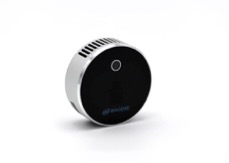

Among the recordings performed during the first session with the Coull quartet, LiDAR data was captured for each of the musicians. LiDAR (Light Detection and Ranging) determines distance at several points by measuring how long it takes laser light to reach an object and reflect back. This data will allow the creation of 3D animated musician avatars to be shown in VR and AR.

The recordings were performed using two Intel RealSense LiDAR Camera L515 placed at the sides of the musician, playing alone. Each had a resolution of 640x480 for the depth frames and 1280x720 for the color data, both captured at 30fps.

The data from the two cameras has been cleaned up and combined by aliging the reference systems. Here is an example of the outcome obtained for one of the frames.


