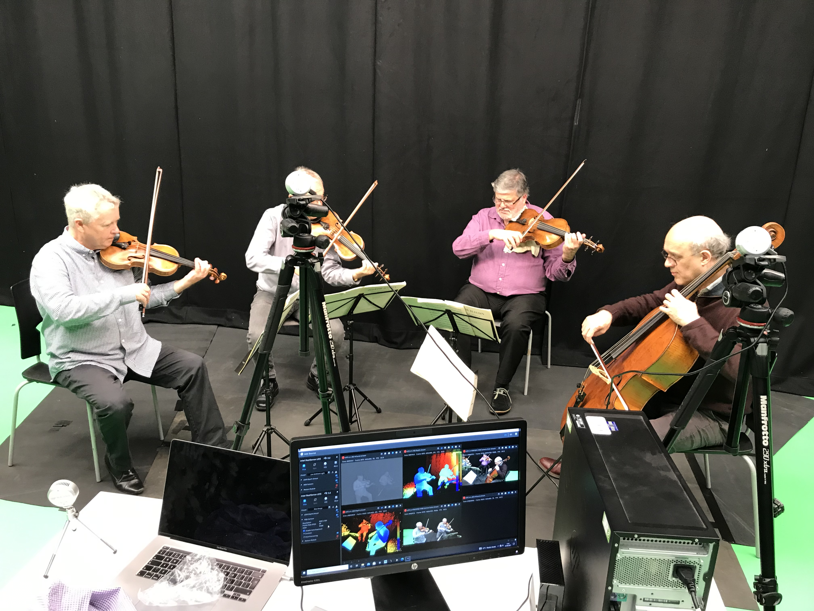
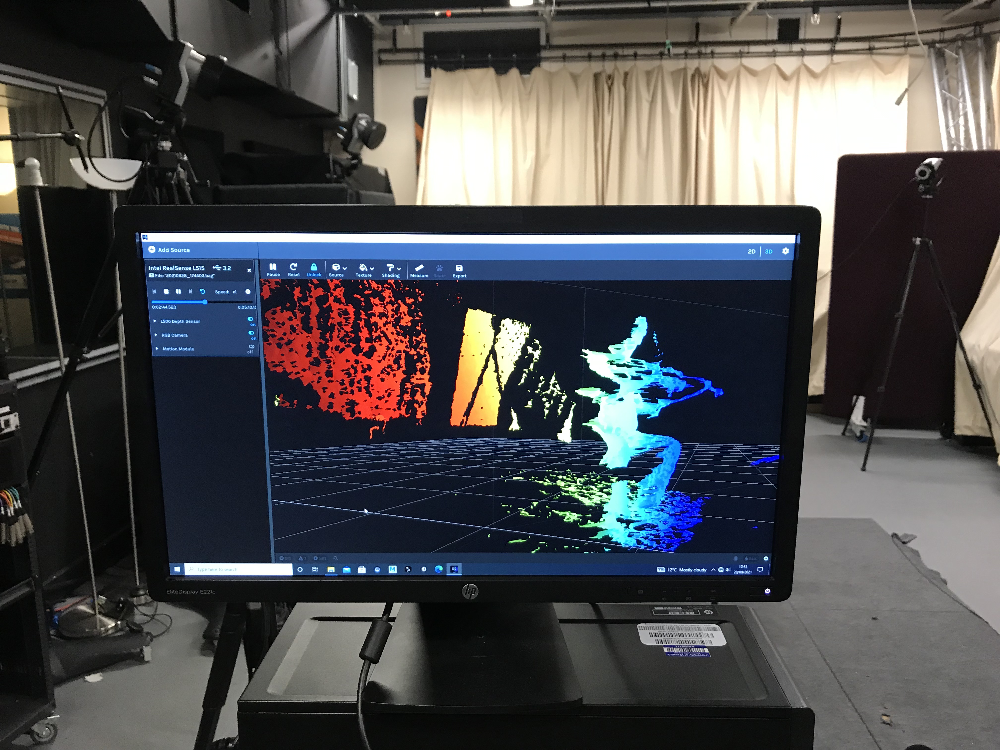
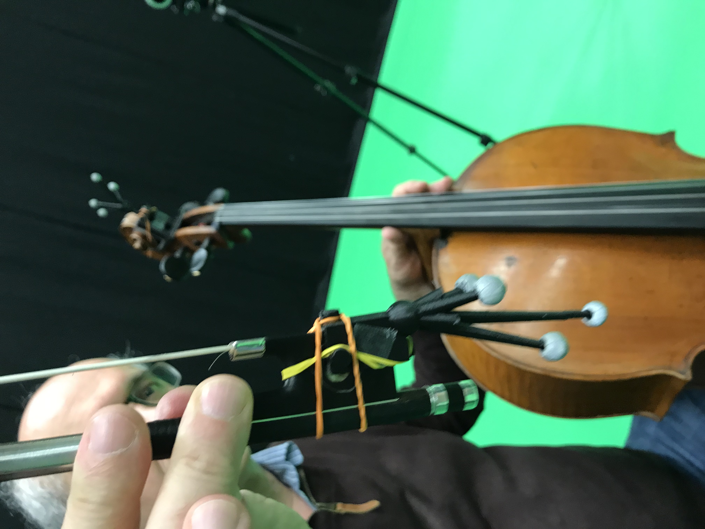
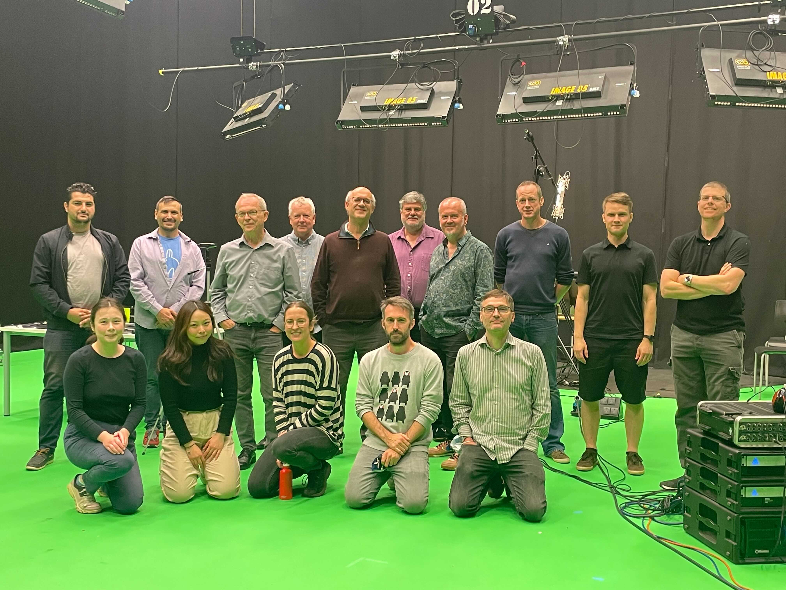

At the BCU media labs, with our partners [Semantic audio](http://www.semanticaudio.co.uk) and [Partplay](https://partplay.co.uk), we recently recorded the musicians of the [Coull quartet](http://www.coullquartet.com) performing numerous pieces from Haydn and Beethoven.

We asked the Coulls to play the parts multiple times in different styles (also in trios and duos formations).

We used several technologies like multiple tracks microphones, field microphones, contact microphones, optical markers, video cameras, LIDARs, and a 360 camera.

It has been an inspiring and busy week. We ended up learning, getting terabytes of data, but most of all… it has been lots of fun!

We are grateful to everybody who contributed to the wonderful experience, and we are looking forward to scientific results and even more recordings.
